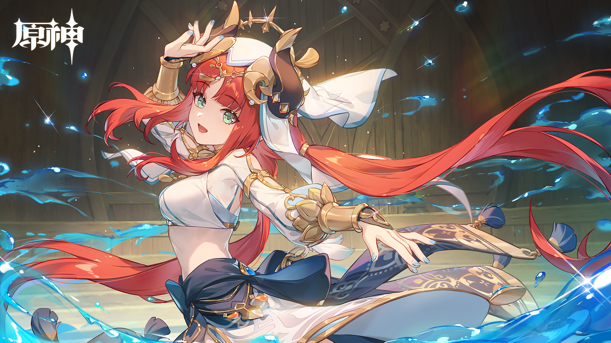
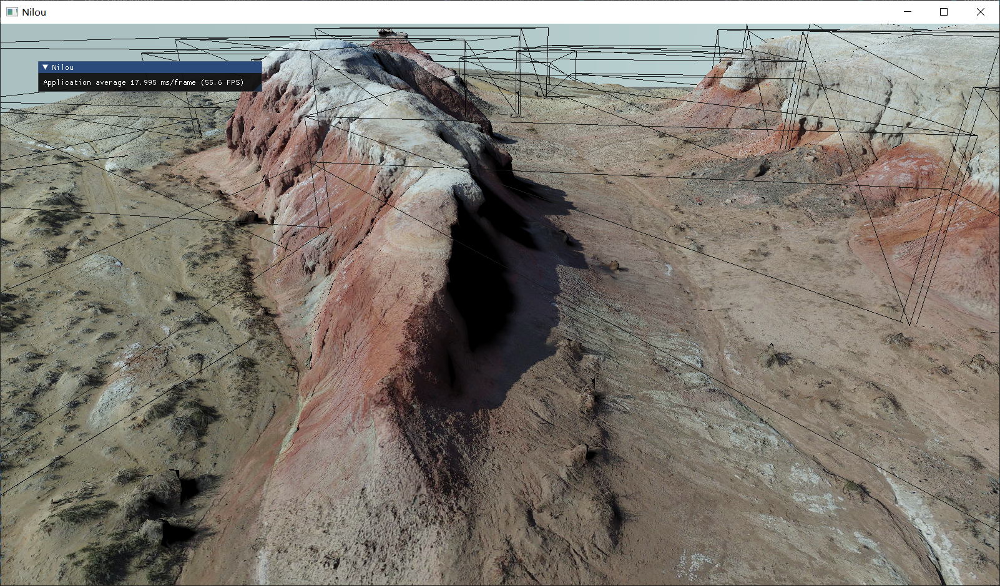
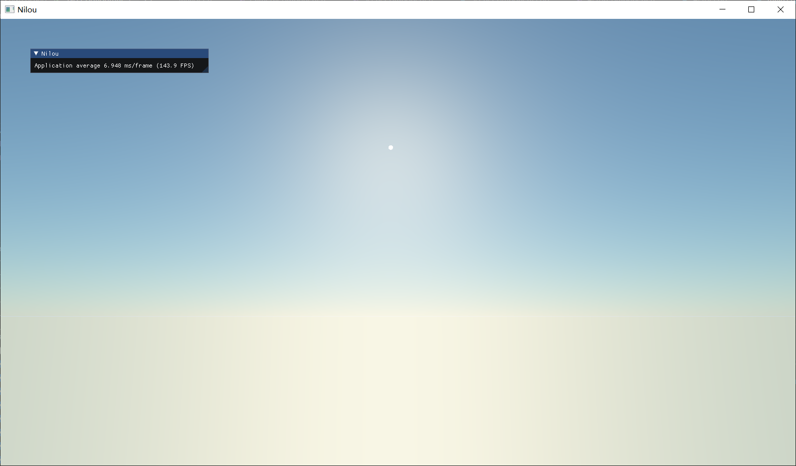
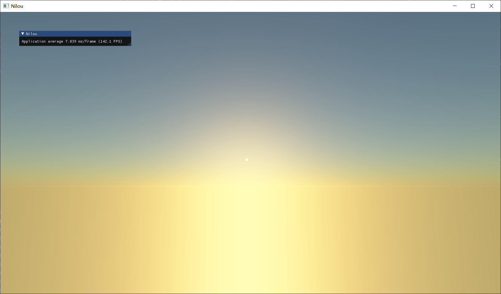
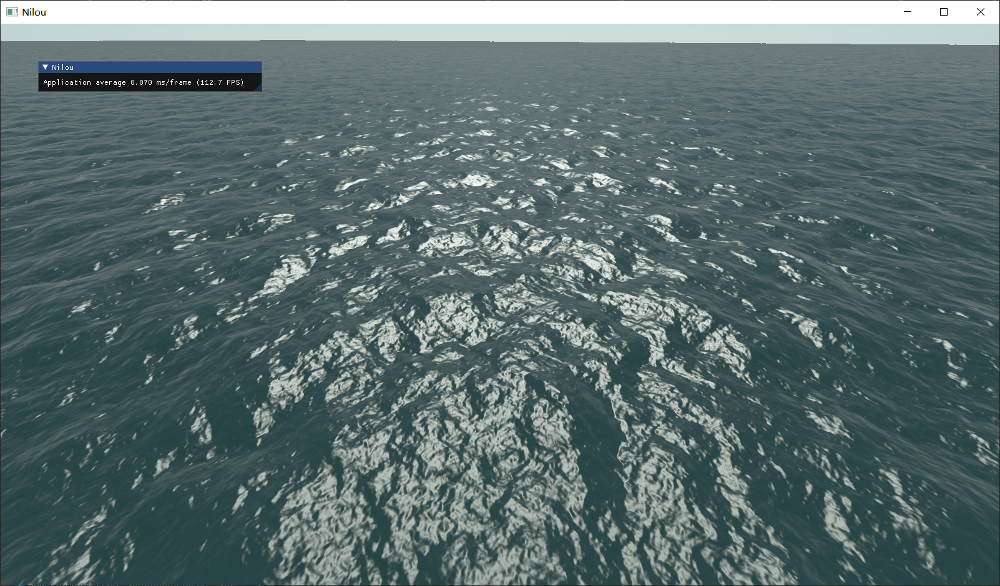
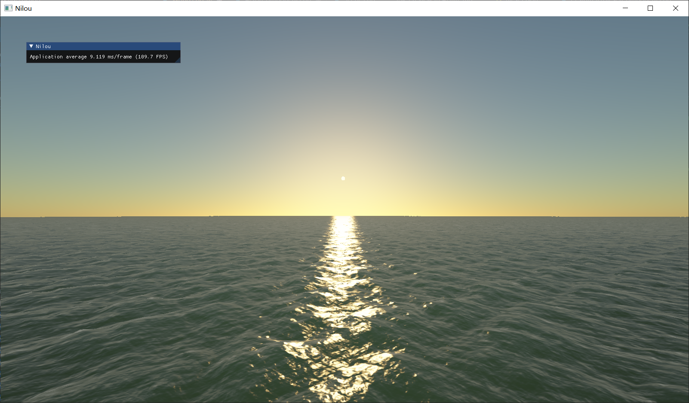
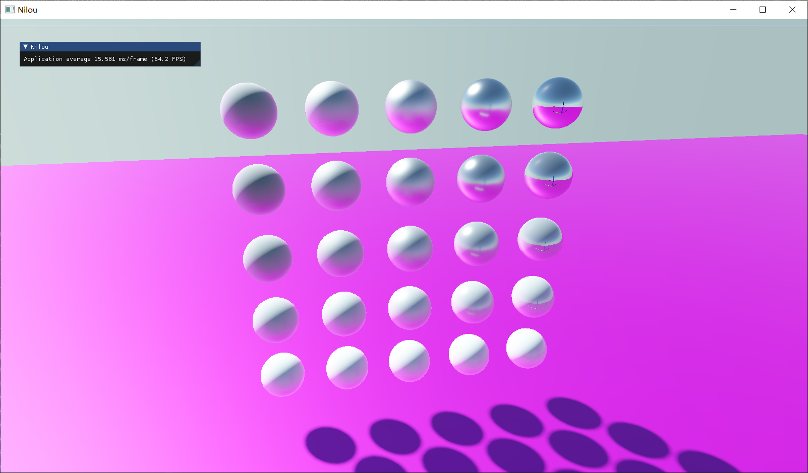
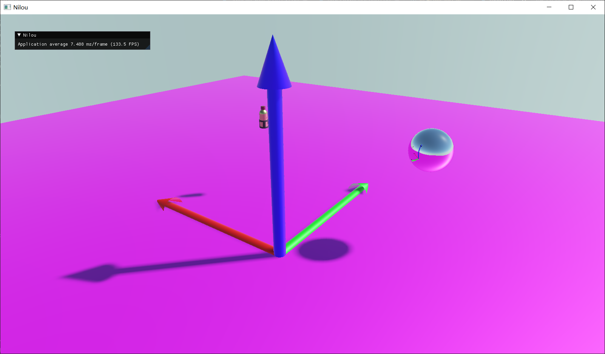

# Nilou
一个自娱自乐的实时渲染引擎  

_她真的好美_
## Overview

原先是我的毕业设计，毕业设计中实现了pbr（部分）、GPU Driven的地形系统（还没搞VT）、大气渲染（还有bug）、FFT海面（这个倒是很完整）  
毕业项目的链接：https://pan.baidu.com/s/104S4944MNkbFUYGAdGSm5A?pwd=y4ws  
提取码：y4ws  
后来我觉得这个还有再继续做下去的价值，可以变成我试验各种图形学算法的游乐场，但是我发现这个项目当时的架构根本就没什么可扩展性，因此开始了长达4个月的重构之旅。  
重构选用了xmake作为构建工具。在重构中我尽量尝试模仿虚幻引擎的Actor和组件机制以及渲染体系，虽然依然很丑，但是已经有了那么一点样子。
构建系统使用xmake，编译器需要为msvc c++20，只能运行在windows系统上。  
WSAD控制移动，鼠标右键缩放视野，lctrl释放鼠标指针。
## 截图
_3DTiles_

  
_大气渲染_


  
_海面_


  
_pbr小球_

  
_反射探针_

  
## 构建
构建顺序如下：

**第一步：** 构建 `NilouHeaderTool`。该工具负责解析 C++ 头文件并自动生成反射相关代码。
```
xmake build NilouHeaderTool
```

**第二步：** 构建 `NilouShaderTool`。该工具负责解析着色器代码并自动生成着色器结构体对应的 C++ 绑定。
```
xmake build NilouShaderTool
```

**第三步：** 构建主目标 `NilouEditor` 或 `NilouGame`。二者目前除模块链接方式不同外基本一致，未来 `NilouEditor` 将引入编辑器 UI 等专属功能。
```
xmake build NilouEditor
```

## Features
- 整体设计思路类似UE（比如用UObject实现反射和序列化，场景由Actor和Component组成，游戏线程/渲染线程，Shader设计等）
- 支持类似UE的侵入式反射（通过NCLASS和NPROPERTY）宏。
- 使用类似UE的GlobalShader和MaterialShader的设计，支持Shader反射，可以根据名称绑定Shader资源。
- 分离的逻辑线程和渲染线程，两个线程使用一些同步手段（用condition_variable实现了一个fence），使得渲染线程不会落后于逻辑线程超过1帧。逻辑线程向渲染线程发送渲染指令的方式是使用ENQUEUE_RENDER_COMMAND宏，这个宏会向渲染线程的任务队列中插入任务，渲染线程在每一帧的开始会从任务队列中取出任务来执行。
- 采用延迟渲染，支持PBR，支持GLTF格式模型，~~~支持3DTiles格式模型的多线程加载，3DTiles瓦片的换入换出使用LRU算法~~~3dtiles的支持还需要重构。
- Cascaded Shadow Map，PCF软阴影。CSM默认使用8级，前4级每帧更新，后4级轮流更新。PCF是7×7的。CSM的分割比例暂时采用了UE的分割方法。
- 支持GPU Driven的地形，参考的是Far Cry 5的地形方案，使用计算着色器实现GPU四叉树划分和视锥剔除，地形高度图支持虚拟纹理（使用Sparse Texture实现）。虚拟纹理的换入换出策略使用LRU算法。
- 支持预计算的大气渲染。在此基础上实现基于物理的、预计算的水体渲染，包含多次散射，能够通过调整水体成分（如有机物、叶绿素浓度）改变水体颜色。（这个在我的毕设项目里，暂时还没有整合到这个引擎里，因为我觉得和大气渲染差不多，意义不大）
- 支持海面的渲染，使用计算着色器进行快速傅里叶变换，生成海面位移贴图和法线贴图，应用于海面着色。
- 支持双精度世界坐标，在渲染时世界坐标会变换到Relative to Eye的坐标。
- 实现了Scene capture和反射探针，实现了IBL。
~~- 同时支持OpenGL和Vulkan（vulkan暂时不支持虚拟纹理）~~目前已不打算支持OpenGL，由于它和现代图形API相差比较大。
## 近期
近期在重构整个项目，已完成的有反射、序列化、模块化等。正在进行中的是重构Shader语言（预计使用slang或HLSL）
## TODO
- HBAO
- Virtual Shadow Map
- 不依赖于硬件的虚拟纹理（就是用另一张纹理来当页表，而不是图形API提供的虚拟纹理 e.g. opengl的sparse texture）
- 水下散射
- 全局光照
- 屏幕空间反射
- TAA
- ......