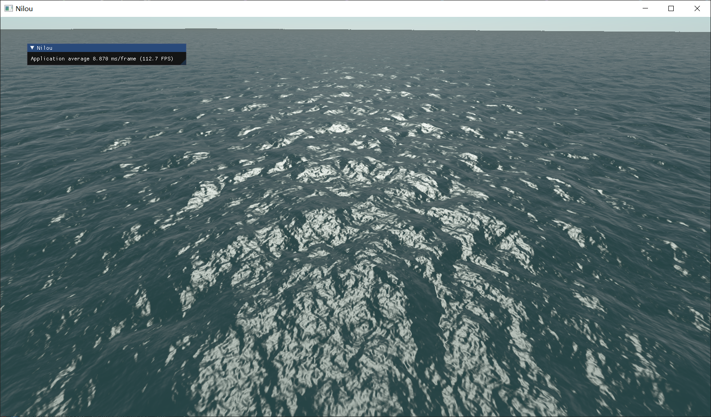

# Nilou
一个自娱自乐的实时渲染引擎  

_她真的好美_
## Overview

原先是我的毕业设计，毕业设计中实现了pbr（部分）、GPU Driven的地形系统（还没搞VT）、大气渲染（还有bug）、FFT海面（这个倒是很完整）  
毕业项目的链接：https://pan.baidu.com/s/104S4944MNkbFUYGAdGSm5A?pwd=y4ws  
提取码：y4ws  
后来我觉得这个还有再继续做下去的价值，可以变成我试验各种图形学算法的游乐场，但是我发现这个项目当时的架构根本就没什么可扩展性，因此开始了长达4个月的重构之旅。  
重构选用了xmake作为构建工具。在重构中我尽量尝试模仿虚幻引擎的Actor和组件机制以及渲染体系，虽然依然很丑，但是已经有了那么一点样子。
构建系统使用xmake，编译器需要为msvc c++20，只能运行在windows系统上。渲染引擎使用vcpkg作为包管理工具，因此需要事先下载vcpkg。  
WSAD控制移动，鼠标右键缩放视野，lctrl释放鼠标指针。
## 截图
_3DTiles_

  
_大气渲染_


  
_海面_


  
_pbr小球_

  
_反射探针_

  
## 运行
1. 首先需要修改configs.lua中vulkan sdk的路径。
2. 编译NilouHeaderTool。每次开始编译前，引擎会自动运行NilouHeaderTool，通过检测头文件的修改时间是否发生变化来判断是否需要重新生成反射代码。注：由于*.generated.cpp里include的头文件不一定就是这个类真正定义在的那个文件，所以有时候*.generated.cpp会找不到这个类的声明了，这个时候把CachedHeaderModifiedTime.txt删除，让header tool重新生成反射代码就好了。
NilouHeaderTool的编译：
```sh
cd NilouHeaderTool
xmake f -p windows -a x64 -m release
xmake -P .
```
3. 接下来编译渲染引擎，渲染引擎的编译和运行如下。编译前会启动vcpkg下载依赖库，会将NilouHeaderTool/src/include/reflection复制到External/include/reflection中。第一次编译的时候会出现一大堆无法解析的外部符号错误，这是正常的，这是因为生成的反射代码没有被xmake加入到构建中，再运行一次编译即可。
```sh
xmake f -p windows -a x64 -m debug
xmake build -v Nilou  
xmake run Nilou
```
如果想要使用Vulkan，需要在可执行程序后面加上参数 ```-rhi vulkan```。
## Features
- 一个比较完备的场景管理架构。参照虚幻引擎搭建了Actor和Component的架构，使得整个项目更有扩展性。
- 简单的侵入式反射，可以查询类的继承关系，可以根据名称创建类的对象，可以根据名称获取成员变量和成员函数，可以自动生成序列化和反序列化代码。通过NilouHeaderTool解析头文件，为打上NCLASS标记的类生成反射信息，然后写入*.generated.cpp中，加入编译。
- 系统中实现了一个简单的虚拟文件系统，用来管理纹理、材质、网格模型等资源。纹理、材质、网格模型具有序列化方法，参考glb格式定义了一种文件格式（nasset）来保存这些资源。
- 对顶点着色器、片元着色器复用的支持。顶点着色器和片元着色器都是MaterialShader，其本身是不完整的。顶点着色器还需要顶点工厂和材质，片元着色器还需要材质，才能构成一个完整的着色器，而顶点工厂和材质则需要实现一系列接口。此外也可以定义GlobalShader，一般用在计算着色器上。
- Shader permutation的支持，MaterialShader和GlobalShader都可以定义一个FPermutationDomain，多个FShaderPermutation*（如FShaderPermutationBool），也就是Domain中的不同维度。系统会自动编译shader所有的permutation，用户可以为每个维度指定值，然后选取对应的permutation。总体来说和UE中对应的功能类似。
- 分离的逻辑线程和渲染线程，两个线程使用一些同步手段（用condition_variable实现了一个fence），使得渲染线程不会落后于逻辑线程超过1帧。逻辑线程向渲染线程发送渲染指令的方式是使用ENQUEUE_RENDER_COMMAND宏，这个宏会向渲染线程的任务队列中插入任务，渲染线程在每一帧的开始会从任务队列中取出任务来执行。
- 对顶点工厂、材质、着色器使用glslang库进行解析，生成一些反射信息，帮助进行资源的绑定。整个过程类似于这样：在渲染端保存一个map，key为变量名称，value为binding point；逻辑端需要提供另一个map作为输入，key为变量名称，value为各种资源。渲染时渲染端根据自己的map，去到输入的map中名称对应的资源。
- 提供了委托模板类，输入系统，还有一些渲染流程中的回调（比如PreRenderDelegate），是建立在这个委托模板上的，Actor可以在自己的构造函数中为按键挂上回调函数从而实现按键的响应。
- 采用延迟渲染，支持PBR，支持GLTF格式模型，支持3DTiles格式模型的多线程加载，3DTiles瓦片的换入换出使用LRU算法。
- Cascaded Shadow Map，PCF软阴影。CSM默认使用8级，前4级每帧更新，后4级轮流更新。PCF是7×7的。CSM的分割比例暂时采用了UE的分割方法。
- 支持GPU Driven的地形，参考的是Far Cry 5的地形方案，使用计算着色器实现GPU四叉树划分和视锥剔除，地形高度图支持虚拟纹理（使用Sparse Texture实现）。虚拟纹理的换入换出策略使用LRU算法。
- 支持预计算的大气渲染。在此基础上实现基于物理的、预计算的水体渲染，包含多次散射，能够通过调整水体成分（如有机物、叶绿素浓度）改变水体颜色。（这个在我的毕设项目里，暂时还没有整合到这个引擎里，因为我觉得和大气渲染差不多，意义不大）
- 支持海面的渲染，使用计算着色器进行快速傅里叶变换，生成海面位移贴图和法线贴图，应用于海面着色。
- 支持双精度世界坐标，在渲染时世界坐标会变换到Relative to Eye的坐标。
- 实现了Scene capture和反射探针，实现了IBL。
- 同时支持OpenGL和Vulkan（vulkan暂时不支持虚拟纹理）
## TODO
- HBAO
- Virtual Shadow Map
- 不依赖于硬件的虚拟纹理（就是用另一张纹理来当页表，而不是图形API提供的虚拟纹理 e.g. opengl的sparse texture）
- 水下散射
- 全局光照
- 屏幕空间反射
- TAA
- ......